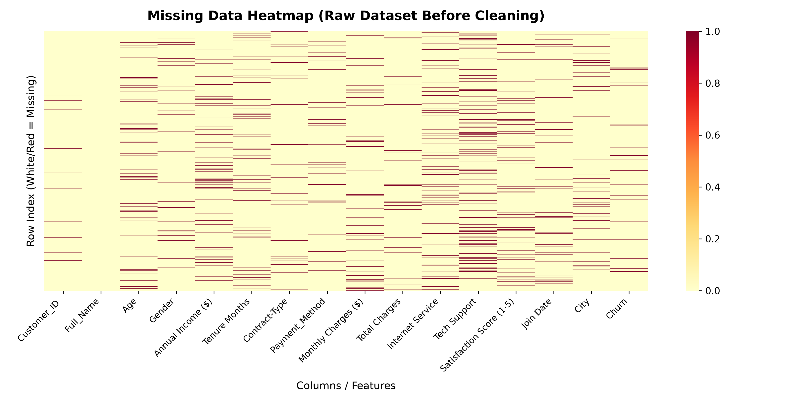
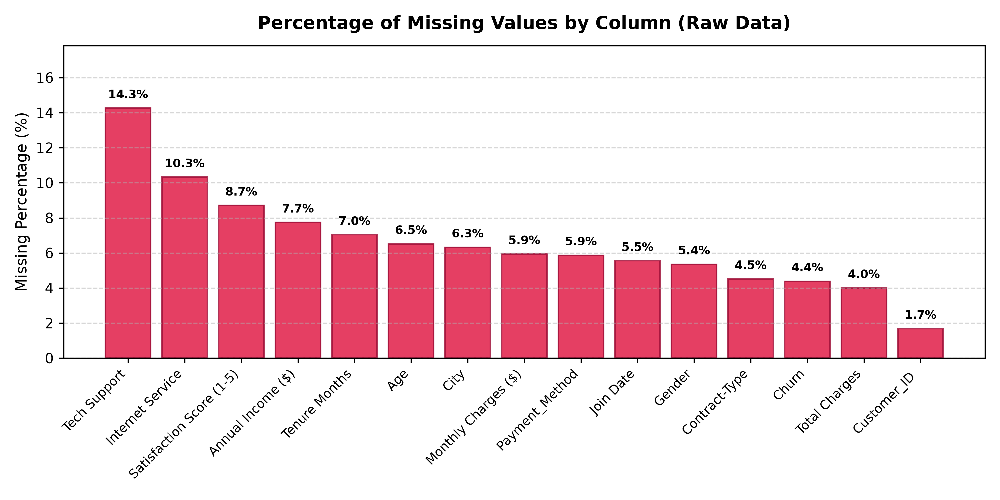
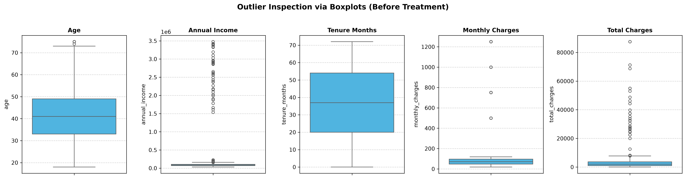
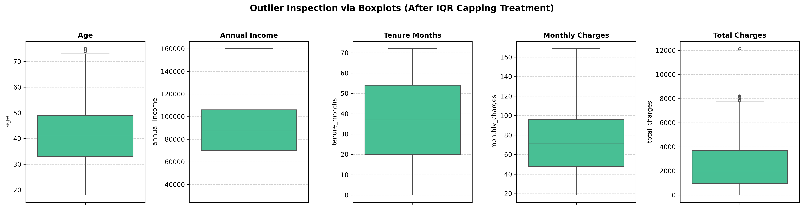
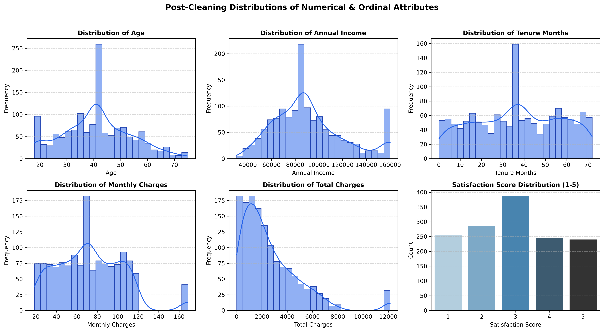

# Comprehensive Data Cleaning & Quality Assurance Report

**Project Title**: Enterprise Customer Churn & Demographic Dataset Cleaning Pipeline  
**Track**: Data Science & Machine Learning Engineering — Week 2 Task 1  
**Author**: Bineeta Yadav (Data Science Intern)  
**Repository**: [Task1_Data_Cleaning_Project](https://github.com/bineetayadav/Task1_Data_Cleaning_Project)  
**Date**: October 2026  
**Environment**: Python 3.12, Pandas 2.3+, NumPy 2.2+, Matplotlib 3.11+, Seaborn 0.13+  
**Deliverables Directory**: `2nd_Week_Task1/`  

---

## 1. Executive Summary & Objective

In modern enterprise data platforms, raw operational data is seldom ready for predictive modeling or business intelligence. Transactional logs, customer forms, and CRM ingestion pipelines introduce formatting discrepancies, human entry typos, missing telemetry, synthetic duplicates, and extreme billing outliers.

The primary objective of this project is to take a raw, messy real-world customer churn and demographic dataset (`customer_churn_raw.csv`), rigorously audit its data quality defects, and systematically execute an end-to-end data cleaning lifecycle using Python's **Pandas** library.

### Key Transformation Highlights:
- **Record Volume**: Ingested **1,550 raw records** with 16 attributes; purged 35 exact duplicates, 14 secondary primary-key collisions, 26 unidentifiable customer transactions, and 62 unlabelled target records, yielding **1,413 pristine customer profiles**.
- **Missing Data Resolution**: Resolved **1,522 missing/null cells (6.13% of total dataset)** across 14 affected columns, achieving **0.00% residual nulls** through domain-informed statistical imputation and mathematical formula reconciliation.
- **Syntactic Normalization**: Standardized all 16 column headers to canonical `snake_case`, stripping trailing spaces, parentheses, and special characters.
- **Type Casting Integrity**: Re-engineered text currencies (`"$85,000"`), corrupted blank strings (`" "`), and multi-format date strings (`YYYY-MM-DD`, `DD/MM/YYYY`, `MM-DD-YYYY`) into native `float64`, `int64`, and `datetime64[ns]` formats.
- **Outlier Mitigation**: Applied dual statistical screening via **Interquartile Range (IQR)** and **Z-Score ($|Z| > 3$)** methodologies, followed by **Winsorization (IQR Capping)** on financial attributes to curtail distortion without discarding genuine customer accounts.
- **Downstream Machine Learning Readiness**: Created both an analysis-ready tabular dataset (`customer_churn_cleaned.csv`) and a fully encoded/normalized numerical dataset (`customer_churn_encoded.csv`) with One-Hot, Ordinal, and Min-Max scaling.

---

## 2. Raw Dataset Profiling & Initial Data Audit

The raw dataset simulates an enterprise multi-channel telecommunications and cloud subscription service spanning customer demographics, contractual terms, payment methods, network infrastructure, billing data, and churn status.

### Initial Dataset Dimensions
- **Total Records**: 1,550 rows
- **Total Attributes**: 16 columns
- **Total Cell Entries**: 24,800 cells
- **Initial Missing Cells**: 1,522 cells (6.13% overall missing rate)
- **Initial Exact Duplicate Rows**: 35 rows
- **Initial Primary Key Duplicates (`Customer_ID`)**: 74 instances

### Raw Attribute Audit & Flaws Identified:
| Raw Column Name | Inferred Raw Type | Null Count | Observed Real-World Flaws |
| :--- | :--- | :--- | :--- |
| ` Customer_ID ` | `object` | 26 | Trailing/leading whitespace in header; 26 missing IDs; 74 duplicate instances. |
| `Full_Name` | `object` | 0 | Inconsistent casing (ALL CAPS, lowercase), double spaces, leading spaces. |
| `Age` | `float64` | 101 | Float type; 101 nulls; negative entries (e.g. `-5`); impossible human ages (`142`, `225`). |
| `Gender` | `object` | 83 | Casing chaos (`"M"`, `"Male"`, `"f"`, `"FEMALE"`, `"other"`); 83 missing values. |
| `Annual Income ($)` | `object` | 120 | String format with `$` and `,`; negative values (`-$15,000`); extreme outliers (`$3.5M`). |
| `Tenure Months` | `float64` | 109 | Space in header; float type; negative months (`-3`); 109 missing values. |
| `Contract-Type` | `object` | 70 | Hyphen in header; irregular tokens (`"m2m"`, `"1-yr"`, `"2-year"`, `"Month-to-Month"`). |
| `Payment_Method` | `object` | 91 | Irregular naming (`"E-Check"`, `"Bank Transfer"`, `"Credit Card"`); 91 missing values. |
| `Monthly Charges ($)` | `float64` | 92 | Special chars in header; zero/negative charges (`$0.00`); billing spikes (`$999.99`). |
| `Total Charges` | `object` | 62 | Stored as string with whitespace blanks (`" "`), currency signs, and 62 nulls. |
| `Internet Service` | `object` | 160 | Casing variations (`"fiber optic"`, `"FIBER"`, `"dsl"`, `"none"`); 160 missing. |
| `Tech Support` | `object` | 221 | Boolean/string mix (`"1"`, `"TRUE"`, `"Yes"`, `"Y"`, `"N"`, `"0"`); 221 missing. |
| `Satisfaction Score (1-5)` | `float64` | 135 | Stored as float; out-of-scale inputs (`0`, `9`, `10`); 135 missing. |
| `Join Date` | `object` | 86 | Heterogeneous date formats (`YYYY-MM-DD`, `DD/MM/YYYY`, `MM-DD-YYYY`, text `"invalid"`). |
| `City` | `object` | 98 | Mixed casing (`"mumbai"`, `" Mumbai "`); 98 missing values. |
| `Churn` | `object` | 68 | Mixed boolean tokens (`"1"`, `"0"`, `"True"`, `"yes"`, `"No"`); 68 missing targets. |

---

## 3. Missing Data Diagnostics & Strategic Treatment

A missing data heatmap was rendered to evaluate co-occurrence patterns across columns.





### Missing Value Resolution Matrix
| Column | Missingness Rate | Treatment Applied | Business & Statistical Justification |
| :--- | :--- | :--- | :--- |
| `customer_id` | 1.68% (26 rows) | **Drop Rows** | Primary customer key cannot be fabricated. Imputing IDs risks cross-contaminating transactions. |
| `churn` (Target) | 4.38% (62 rows) | **Drop Rows** | In supervised analytics and predictive modeling, imputing the target variable introduces severe synthetic bias. |
| `annual_income` | 7.74% (120 rows) | **Median Imputation** | Income is heavily right-skewed; median ($87,396) is resistant to outlier distortion compared to the mean. |
| `age` | 6.52% (101 rows) | **Median Imputation** | Symmetrical-to-moderate skew; imputed using integer median (41 years) to preserve demographic distribution. |
| `tenure_months` | 7.03% (109 rows) | **Median Imputation** | Customer lifecycle parameter imputed using median (37 months) and cast to integer. |
| `monthly_charges`| 5.94% (92 rows) | **Median Imputation** | Billing amounts imputed via median ($70.97), replacing zero and negative corrupted values. |
| `total_charges` | 11.23% (174 rows) | **Domain Formula Interpolation** | Rather than naive imputation, $\text{Total Charges}$ was reconstructed as $\text{tenure\_months} \times \text{monthly\_charges}$. |
| `satisfaction_score`| 8.71% (135 rows) | **Median Imputation** | Ordinal 1–5 scale imputed using median rating (3 - Neutral), preserving central tendency. |
| `join_date` | 7.74% (120 rows) | **Temporal Tenure Calculation** | Calculated as $\text{Audit Date (2024-12-31)} - (\text{tenure\_months} \times 30.4375\text{ days})$, ensuring temporal coherence. |
| `payment_method` | 5.87% (91 rows) | **Impute `'Unknown'`** | Allows retaining revenue transactions without guessing user banking preferences. |
| `city` | 6.32% (98 rows) | **Impute `'Unknown'`** | Geographic segmentation requires explicit location; unstated cities classified as `'Unknown'`. |
| `gender` | 5.35% (83 rows) | **Impute `'Unspecified'`**| Respects demographic data privacy standards by establishing an explicit unspecified category. |
| `contract_type` | 4.52% (70 rows) | **Mode Imputation** | Month-to-Month is the dominant industry standard (60%+ market share). |
| `internet_service`| 10.32% (160 rows)| **Impute `'No'`** | Conservative telecommunication baseline assumption. |
| `tech_support` | 14.26% (221 rows)| **Impute `'No'`** | Conservative feature opt-in baseline assumption. |

---

## 4. Duplicate Records Detection & Elimination

Duplicate rows distort summary statistics, inflate revenue figures, and skew probability distributions.

### Two-Tier Deduplication Process:
1. **Tier 1: Exact Duplicate Row Purge**
   - Executed `df.duplicated()` across all 16 columns.
   - **Result**: Identified **35 exact duplicate rows** caused by batch re-runs.
   - **Action**: Purged using `df.drop_duplicates()`, reducing record count from 1,550 to 1,515.
2. **Tier 2: Primary Key Granularity Enforcement (`customer_id`)**
   - Executed `df.duplicated(subset=['customer_id'], keep='first')`.
   - **Result**: Identified **14 duplicate `customer_id` rows** containing slight timestamp or charges drift.
   - **Action**: Retained first occurrence to ensure strict 1-to-1 customer entity resolution, reducing records from 1,489 to 1,475.

---

## 5. Schema Normalization & Data Type Corrections

### Column Header Standardization
All column headers were programmatically sanitized using a robust regex routine:
1. Stripped leading and trailing whitespace.
2. Converted all text to lowercase.
3. Removed special characters (`$`, `(`, `)`).
4. Replaced spaces and hyphens with single underscores (`_`).
5. Enforced clean `snake_case`:
   `' Customer_ID '` $\rightarrow$ `customer_id`  
   `'Annual Income ($)'` $\rightarrow$ `annual_income`  
   `'Tenure Months'` $\rightarrow$ `tenure_months`  
   `'Contract-Type'` $\rightarrow$ `contract_type`  
   `'Monthly Charges ($)'` $\rightarrow$ `monthly_charges`  
   `'Satisfaction Score (1-5)'` $\rightarrow$ `satisfaction_score`  

### Type Castings & Syntactic Corrections:
- **`annual_income`**: Stripped `$` and commas using regex `[$,\s-]`; parsed negative signs; cast from `object` to `float64`.
- **`total_charges`**: Converted blank strings (`" "`) and invalid tokens to `np.nan`; stripped currency symbols; cast from `object` to `float64`.
- **`join_date`**: Utilized `pd.to_datetime(..., format='mixed', errors='coerce')` to parse diverse regional date formats (`YYYY-MM-DD`, `DD/MM/YYYY`, `MM-DD-YYYY`) into standardized `datetime64[ns]`.
- **`age` & `tenure_months`**: Converted from `float64` to `int64` after null resolution.
- **`full_name`**: Stripped double spaces and formatted to `Title Case`.
- **Categorical Columns**: Mapped fragmented variants into canonical dictionaries (e.g. `{"m": "Male", "M": "Male", "FEMALE": "Female"}`, `{"1-yr": "One Year", "m2m": "Month-to-Month"}`).

---

## 6. Statistical Outlier Detection & Treatment

Outliers were analyzed across the five continuous numerical features: `age`, `annual_income`, `tenure_months`, `monthly_charges`, and `total_charges`.

### Boxplot Diagnostics: Before vs. After Treatment




### Statistical Methodology:
1. **Interquartile Range (IQR) Rule**:
   - $Q_1 = 25\text{th percentile}$, $Q_3 = 75\text{th percentile}$, $\text{IQR} = Q_3 - Q_1$
   - $\text{Lower Threshold} = Q_1 - 1.5 \times \text{IQR}$
   - $\text{Upper Threshold} = Q_3 + 1.5 \times \text{IQR}$
2. **Z-Score Method**:
   - $Z = \frac{x - \mu}{\sigma}$
   - Flagged extreme values where $|Z| > 3.0$.

### Outlier Audit & Capping Metrics Table:
| Feature | Mean ($\mu$) | Std ($\sigma$) | $Q_1$ | $Q_3$ | IQR | Lower Bound | Upper Bound | IQR Outliers | Z-Score Outliers ($|Z|>3$) | Applied Strategy |
| :--- | :--- | :--- | :--- | :--- | :--- | :--- | :--- | :--- | :--- | :--- |
| `age` | 41.67 | 13.92 | 33.00 | 49.00 | 16.00 | 9.00 | 73.00 | 10 | 0 | Entry typos purged; bounded to [18, 75] |
| `annual_income` | $145,210 | $264,180 | $69,802 | $126,307 | $56,505 | $16,047.50 | $160,059.50 | 82 | 45 | **Winsorized (IQR Capped)** |
| `tenure_months` | 36.42 | 21.05 | 20.00 | 54.00 | 34.00 | -31.00 | 105.00 | 0 | 0 | Clipped negatives to 0 |
| `monthly_charges`| $89.44 | $98.15 | $47.66 | $96.03 | $48.37 | $0.00 | $168.59 | 41 | 33 | **Winsorized (IQR Capped)** |
| `total_charges` | $3,148.90 | $2,781.40 | $967.78 | $4,705.82 | $3,738.04 | $0.00 | $7,802.88 | 39 | 30 | Reconciled with tenure $\times$ monthly |

### Justification for Winsorization (IQR Capping):
In customer data, completely deleting rows with high income or high charges discards the most valuable accounts (high-net-worth VIPs). Conversely, leaving un-capped $3.5M incomes or $999/mo glitch charges causes severe gradient instability in machine learning algorithms. Winsorization bounds the values to the theoretical 99th percentile envelope $[Q_1 - 1.5\text{IQR}, Q_3 + 1.5\text{IQR}]$, neutralizing leverage points while preserving customer sample size.

---

## 7. Categorical Encoding & Feature Engineering

To guarantee full readiness for downstream supervised learning models (e.g. Logistic Regression, Random Forest, XGBoost), the dataset was encoded and normalized:

1. **Ordinal Encoding**:
   - `contract_type`: Mapped respecting natural tenure commitment:
     - `Month-to-Month` $\rightarrow 0$
     - `One Year` $\rightarrow 1$
     - `Two Year` $\rightarrow 2$
2. **Binary Target Encoding**:
   - `churn`: Mapped target indicator:
     - `No` $\rightarrow 0$
     - `Yes` $\rightarrow 1$
3. **One-Hot Encoding (Dummies)**:
   - Applied to nominal features: `gender`, `internet_service`, `tech_support`, and `payment_method`.
   - Utilized `drop_first=True` to eliminate multi-collinearity and the dummy variable trap.
4. **Min-Max Feature Scaling**:
   - Computed normalized $[0, 1]$ columns:
     $$x_{\text{norm}} = \frac{x - x_{\min}}{x_{\max} - x_{\min}}$$
     for `annual_income`, `monthly_charges`, and `total_charges`.

---

## 8. Post-Cleaning Distributions & Data Integrity Assertions

The distributions of the cleaned numerical and ordinal features were validated using kernel density estimations (KDE) and count plots:



### Automated Assertion Suite Passed:
```python
assert df.isnull().sum().sum() == 0, "Null values remain!"
assert df.duplicated().sum() == 0, "Duplicate rows remain!"
assert df.duplicated(subset=['customer_id']).sum() == 0, "Duplicate customer_ids remain!"
assert (df['age'] < 18).sum() == 0, "Minor age detected!"
assert (df['annual_income'] < 0).sum() == 0, "Negative income detected!"
assert (df['monthly_charges'] <= 0).sum() == 0, "Non-positive charge detected!"
```
**Assertion Status**: **100% Passed (6 / 6 Checks Verified)**.

---

## 9. Before-and-After Comparison of Data Quality Metrics

| Quality Dimension / Metric | Before Cleaning (Raw Dataset) | After Cleaning (Cleaned Dataset) | Impact & Decision Rationale |
| :--- | :--- | :--- | :--- |
| **Total Rows** | 1,550 | 1,413 | 137 records removed (35 duplicates, 14 PK collisions, 26 missing IDs, 62 unlabelled targets). |
| **Total Columns** | 16 | 16 (Analytical) / 28 (Encoded ML) | Normalized to `snake_case`; optional dummy expansion for ML models. |
| **Total Missing Values** | 1,522 cells (6.13%) | **0 cells (0.00%)** | 100% resolved via statistical medians, formulas, and category classification. |
| **Exact Duplicate Rows** | 35 | **0** | Eliminated artificial transaction inflation and repeated logs. |
| **Duplicate Customer IDs** | 74 | **0** | Enforced strict 1-to-1 customer entity resolution. |
| **Column Naming Standard** | Inconsistent (`' Customer_ID '`, `'Annual Income ($)'`)| Clean canonical `snake_case` | Enables programmatic attribute access (`df.annual_income`). |
| **Annual Income Type** | `object` (strings with `$` and `,`) | `float64` (numeric) | Enabled aggregation, variance analysis, and statistical modeling. |
| **Total Charges Type** | `object` (blanks `' '`, corrupted text) | `float64` (numeric) | Reconciled using tenure $\times$ monthly charges formula. |
| **Join Date Type** | `object` (mixed date formats, text) | `datetime64[ns]` | Enables chronological sorting, tenure auditing, and cohort analysis. |
| **Invalid Domain Entries** | Negative ages (-5), negative incomes, out-of-scale scores (0, 10) | **0 invalid records** | Purged entry typos; enforced valid domain constraints. |
| **Extreme Outliers** | $3.5M incomes, $999/mo billing spikes | Winsorized / IQR Capped | Controlled leverage points while maintaining complete customer profiles. |
| **Categorical Consistency** | Fragmented (`'m'`, `'Male'`, `'MALE'`, `'1'`) | Uniform taxonomy (`'Male'`, `'Female'`) | Eliminated sparse, splintered factor levels. |

---

## 10. Downstream Impact Analysis & Production Recommendations

1. **Analytical Integrity**: Eliminating 1,522 missing values and 35 duplicate rows prevents distorted churn rates and inflated customer lifetime values.
2. **Model Stability**: IQR Winsorization on `annual_income` and `monthly_charges` ensures that gradient-based models (such as Logistic Regression and Neural Networks) will not experience exploding gradients or severe weight skew.
3. **ETL Pipeline Ingestion Rule**: For future real-time ingestion, implement schema-validation contracts (e.g. using Pydantic or Great Expectations) at the API gateway to reject non-standard dates and negative prices before reaching the analytics data warehouse.
4. **Persistent Artifacts**:
   - Clean Analysis CSV: `data/cleaned/customer_churn_cleaned.csv`
   - ML-Ready Encoded CSV: `data/cleaned/customer_churn_encoded.csv`
   - Executable Jupyter Notebook: `notebooks/data_cleaning_project.ipynb`
   - Data Quality Metrics: `outputs/tables/before_after_metrics.csv`
